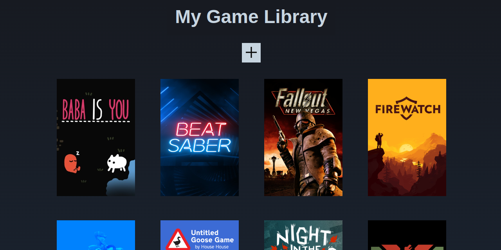

# The Odin Project: Library App
Lesson covering javascript objects

Live: https://vanessapigwin.github.io/top-library/

# Output

## Goal / To Do
- [x] Take user input and store new book objects into array
- [x] Loop through array and display each book on page
- [x] Create the layout
- [x] Create modal-form layout
- [x] Add new book button that will summon form
- [x] Make the form work -  add a book
- [x] Design card of each book
- [x] Add button and function on each book's display to allow removal from library
- [x] Add button and function on each book's display to update read status

## Newly-learned concepts from Activity
- html: file input element
- css: opacity, file selector button 
- js: Form data object
- js: preventing default behavior
- js: this